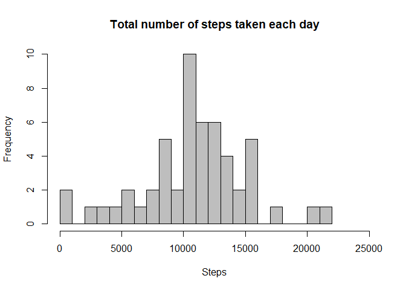
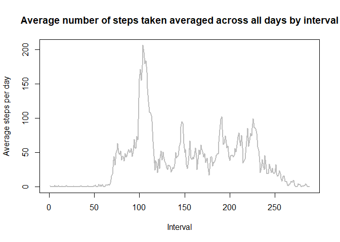
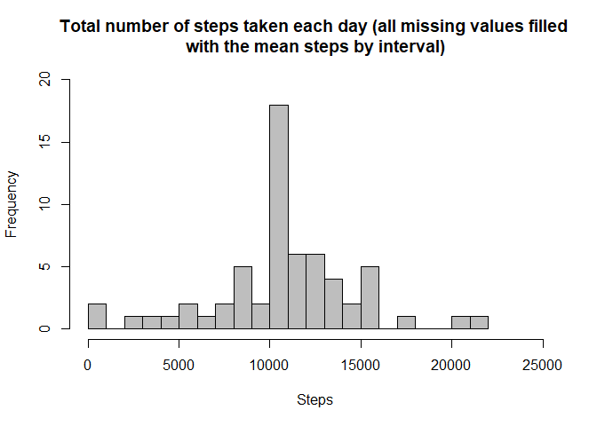
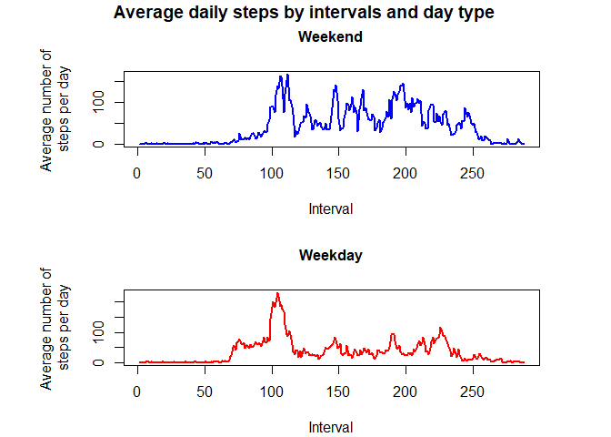

## Loading and preprocessing the data


#### download the dataset

```r
knitr::opts_chunk$set(echo = TRUE)
fileUrl <- "https://d396qusza40orc.cloudfront.net/repdata%2Fdata%2Factivity.zip"
download.file(fileUrl,destfile="./Dataset.zip")
```


#### unzip the dataset 

```r
knitr::opts_chunk$set(echo = TRUE)
unzip(zipfile="./Dataset.zip")
```


#### read dataset


```r
knitr::opts_chunk$set(echo = TRUE)
wd <- getwd()
activity_dataset <- read.csv(file = paste(wd,"/activity.csv", sep = ""))
```


## What is mean total number of steps taken per day?


### 1. Calculate the total number of steps taken per day


```r
knitr::opts_chunk$set(echo = TRUE)
sum_steps_by_day <- tapply(X = activity_dataset$steps, INDEX = activity_dataset$date, FUN = sum)
```

### 2. Make a histogram of the total number of steps taken each day


```r
knitr::opts_chunk$set(echo = TRUE)
hist(sum_steps_by_day, breaks = 16,
     xlab = "Steps",
     ylab = "Frequency",
     xlim = c(0, 25000),
     main = "Total number of steps taken each day",
     col = "gray",
     cex.main=1.2,
)
```

<!-- -->

### 3. Calculate and report the mean and median of the total number of steps taken per day


#### Mean:

```r
knitr::opts_chunk$set(echo = TRUE)
mean(sum_steps_by_day, na.rm = T)
```

```
## [1] 10766.19
```


#### Median:

```r
knitr::opts_chunk$set(echo = TRUE)
median(sum_steps_by_day, na.rm = T)
```

```
## [1] 10765
```


## What is the average daily activity pattern?


### 1. Make a time series plot (i.e. type = "l"\color{red}{\verb|type = "l"|}type="l") of the 5-minute interval (x-axis) and the average number of steps taken, averaged across all days (y-axis)


```r
knitr::opts_chunk$set(echo = TRUE)
mean_steps_by_interval <- tapply(X = activity_dataset$steps, INDEX = activity_dataset$interval, FUN = mean, na.rm = T)

plot(mean_steps_by_interval, type="l",
     xlab = "Interval",
     ylab = "Average steps per day",
     main = "Average number of steps taken averaged across all days by interval",
     cex.main=1.2,
     lwd = 2,
     lty = 1,
     col = "gray"
     )
```

<!-- -->


### Which 5-minute interval, on average across all the days in the dataset, contains the maximum number of steps?


```r
knitr::opts_chunk$set(echo = TRUE)
names(which.max(mean_steps_by_interval))
```

```
## [1] "835"
```


## Imputing missing values


### 1. Calculate and report the total number of missing values in the dataset (i.e. the total number of rows with NA\color{red}{\verb|NA|}NAs)


```r
knitr::opts_chunk$set(echo = TRUE)
sum(is.na(activity_dataset$steps))
```

```
## [1] 2304
```


### 2. Devise a strategy for filling in all of the missing values in the dataset. The strategy does not need to be sophisticated. For example, you could use the mean/median for that day, or the mean for that 5-minute interval, etc.


```r
knitr::opts_chunk$set(echo = TRUE)

### Create a new object to fill NA with
fill_na_activity_dataset <- activity_dataset

### Extract "NA" rows
na <- is.na(activity_dataset$steps)

### Assign "NA"s with the mean for the respectives 5-minute intervals
fill_na_activity_dataset$steps[na] <- mean_steps_by_interval[as.character(fill_na_activity_dataset$interval[na])]
```


### 3. Create a new dataset that is equal to the original dataset but with the missing data filled in.


```r
knitr::opts_chunk$set(echo = TRUE)
new_sum_steps_by_day <- tapply(fill_na_activity_dataset$steps, fill_na_activity_dataset$date, sum, na.rm=TRUE)
```


### 4. Make a histogram of the total number of steps taken each day.


```r
knitr::opts_chunk$set(echo = TRUE)
hist(new_sum_steps_by_day, breaks = 20,
     xlab = "Steps",
     ylab = "Frequency",
     ylim = c(0,20),
     xlim = c(0,25000),
     main = "Total number of steps taken each day (all missing values filled \nwith the mean steps by interval)",
     col = "gray",
     cex.main=1.2,
)
```

<!-- -->


### 4.1. Calculate and report the mean and median total number of steps taken per day.


#### Mean:

```r
knitr::opts_chunk$set(echo = TRUE)
mean(new_sum_steps_by_day, na.rm = T)
```

```
## [1] 10766.19
```


#### Median:

```r
knitr::opts_chunk$set(echo = TRUE)
median(new_sum_steps_by_day, na.rm = T)
```

```
## [1] 10766.19
```


### Do these values differ from the estimates from the first part of the assignment?


#### Mean and median from the first part of the assignment:


#### Mean:

```r
knitr::opts_chunk$set(echo = TRUE)
mean(sum_steps_by_day, na.rm = T) == mean(new_sum_steps_by_day, na.rm = T)
```

```
## [1] TRUE
```

```r
##[1] TRUE
### The mean did not differ.
```


#### Median:

```r
knitr::opts_chunk$set(echo = TRUE)
median(sum_steps_by_day, na.rm = T)/median(new_sum_steps_by_day, na.rm = T)
```

```
## [1] 0.9998896
```

```r
##[1] 0.9998896
### the median differed 0.01104%.
```


### What is the impact of imputing missing data on the estimates of the total daily number of steps?


#### There has been an increase in the frequency of daily average steps. However, the distribution remained the same for the other values.


## Are there differences in activity patterns between weekdays and weekends?


### 1. Create a new factor variable in the dataset with two levels – “weekday” and “weekend” indicating whether a given date is a weekday or weekend day.


```r
knitr::opts_chunk$set(echo = TRUE)
### Function to indicate whether a given date is a weekday or weekend day
func <- function(x) {
    if(weekdays(as.Date(x)) == "Saturday" | weekdays(as.Date(x)) == "Sunday"){
        "weekend"}
    else("weekday")
}

### create a vector of day type per date
weekday <- sapply(fill_na_activity_dataset$date, func)


### create a the "day_type" variable with two levels – “weekday” and “weekend”
fill_na_activity_dataset$day_type <- as.factor(weekday)
```

### 2. Make a panel plot containing a time series plot (i.e. type = "l"\color{red}{\verb|type = "l"|}type="l") of the 5-minute interval (x-axis) and the average number of steps taken, averaged across all weekday days or weekend days (y-axis). See the README file in the GitHub repository to see an example of what this plot should look like using simulated data.


```r
knitr::opts_chunk$set(echo = TRUE)
### average number of steps taken averaged across all days
mean_steps_by_interval_by_day_type <- aggregate(steps ~ day_type+interval, data=fill_na_activity_dataset, FUN=mean)

### split by “weekday” and “weekend”
mean_steps_by_interval_by_weekday <- split(mean_steps_by_interval_by_day_type, mean_steps_by_interval_by_day_type$day_type)

### set parameters to combine 2 plots arranged in 2 rows and 1 column
par(mfrow=c(2,1))
par(mar=c(4.1,7.1,4.1,4.1))

### pannel 1

plot(mean_steps_by_interval_by_weekday$weekend$steps, type="l",
     xlab = "Interval",
     ylab = paste("Average number of \nsteps per day"),
     main = "Weekend",
     cex.main=1,
     lwd = 2,
     lty = 1,
     col = "blue"
     )

### pannel 2

plot(mean_steps_by_interval_by_weekday$weekday$steps, type="l",
     xlab = "Interval",
     ylab = paste("Average number of \nsteps per day"),
     main = "Weekday",
     cex.main=1,
     lwd = 2,
     lty = 1,
     col = "red")

title("Average daily steps by intervals and day type", outer=TRUE, line = -1)
```

<!-- -->

